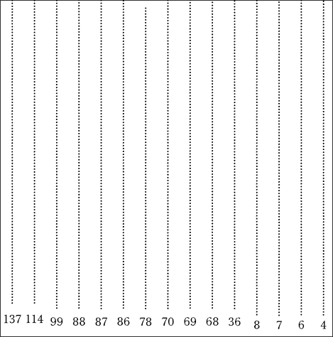
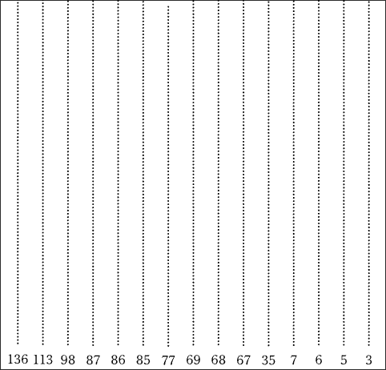
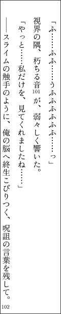
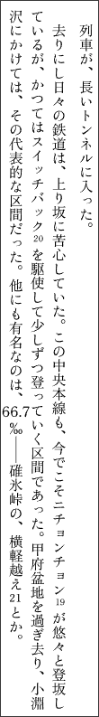
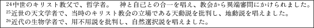
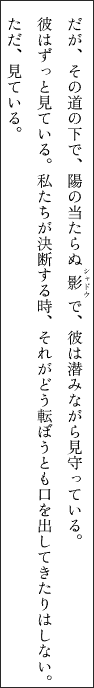
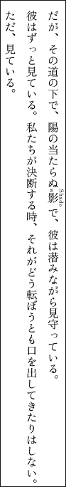
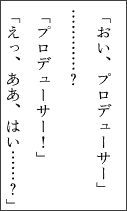
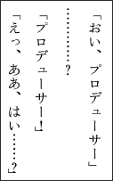
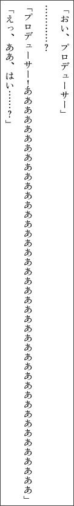

## 目次

- [目次](#目次)
- [はじめに](#はじめに)
- [作ったもの](#作ったもの)
- [縦書き Typst の問題点について](#縦書き-typst-の問題点について)
  - [目次表示タイプ 1-2](#目次表示タイプ-1-2)
  - [脚注番号](#脚注番号)
  - [ルビ](#ルビ)
  - [記号あれこれ](#記号あれこれ)
  - [`vertical_block` と改ページ](#vertical_block-と改ページ)
- [むすびに](#むすびに)

## はじめに

皆様ごきげんよう、AK47 です。

忙しくてブログの更新というやつをサボっていましたが、この度大学の方も落ち着いたので[^1]、初記事をしたためます。

内容は [kanata](https://twitter.com/kanata201612) さんが作成された[縦書き Typst](https://booth.pm/ja/items/8064063) についてです。

## 作ったもの

縦書き Typst によって組版したものが、05/31 (日) に開催された『歌姫庭園 43』において頒布した、こちらになります。

[Schwarze Schwalbe ―雨夜燕二次創作小説まとめ本―](https://anima-kristall.booth.pm/items/8440593)


こちらの組版に際して、縦書き Typst の機能として気になった問題点を、いくつか書き留めておきます。もし既出のものがあったら、ご容赦ください。

もし kanata さんご本人が見ていらっしゃいましたら、是非コメントをいただきたいです（他力本願）。

では、以下に問題点を書きます。個人的に重大度が高かった問題から降順に並べてあります。

## 縦書き Typst の問題点について

### 目次表示タイプ 1-2

今回、こちらの同人誌の組版には、目次表示タイプ 1-2 を用いました。

ところがこのタイプは曲者でして、以下のようにノンブルの Y 座標が合わないのでした。



一目見て、1 桁のノンブルよりも 2 桁のそれが、さらに 3 桁のそれはより上に位置していることがわかります。

これはどうしたもんかなと思い、テンプレートを次のように変更してみました。

```typst
//
// 目次表示（タイプ1）
//
#let display_table_of_contents_type1(height: 45%,dx: 0pt) = [
  // ------ 章の見た目をカスタマイズする ------
  // 目次のフィラーを設定（縦書き用のフィラーを設定する）
  #set outline.entry(fill: repeat(".")) // 点の形式
  //set outline.entry(fill: line(length: 100%, stroke: 1pt + gray)) // 線の形式
  // 目次間の行間調整
  #show outline.entry: set block(above: 1.2em)
  // 全体設定
  #show outline.entry: it => link(
    it.element.location(),
    it.indented(
      it.prefix(),
      // inner の代わりに個別に構成
      [
        #let page = int(it.page().text);
        #let offset-x = if int(page) <= 10 { -0.30em } else if int(page) < 100 { 0em } else { 0.20em }
        #let h_size = if int(page) <= 10 { 2pt - offset-x * 2 } else { 2pt }
        #text(size: 1.1em)[#it.body()] // 見出しのサイズ調整
        #h(h_size)
        #box(width: 1fr, move(dx: offset-x * 2, dy: -0.3em)[#it.fill])  // リーダー（点線など）・位置調整
        #h(2pt)
        #box(move(dx: offset-x, dy: -0.00em)[#rotate(270deg)[#page]])  // ページ番号の回転・位置調整
      ],
    ),
  )
  // 目次の表示
  #move(dx: dx)[
    #vertical_block(width: 500%,height: height)[
      #outline(
        title: "目次", // 目次タイトル
        depth: 3,      // 目次の深さ
        indent: 2em,   // 目次のインデント
      )
    ]
  ]
]
```

※ なお、数値は完全に目視なので、これといった計算をした訳ではありません。したがって、この数値はベストプラクティスではありません。

`offset-x` を新たに定義し、2 桁のノンブルに合わせる形で 1 桁を上へ、3 桁を下へ移動させました。それに伴って、リーダーも動かしています。

という訳で、次のようになりました。



※ ページ番号は諸事情あって `-1` を加えているため、先ほどから 1 ずつ減っています。

少しはマシになりましたが、よく見ると、まだ少し粗がありますね。より良いプラクティスを知っている方がいらっしゃればご教示ください。

### 脚注番号

今回組版したまとめ本は、ただの再録だけでなく、脚注に著者の実況を書くということをしていました。これがなかなかに分量の多いもので、脚注の数が 3 桁台に乗ってしまったのです。

すると、このような問題が生じてしまいました。



そう、流石に収まり切らなくなってしまったのです。しかし、フォントサイズを小さくしようという努力はしてくれているようですし、こんなに脚注を書く人は、通常ならばいないでしょう。

ところが、もう一つの問題がありました。



19, 20 はフォントサイズが小さくなっているものの、どういう訳か 21 はフォントサイズが小さくなっていません。調査した所、どうも次のような条件の際に発生しているようでした。

- 11 以上 44 以下maxW: 640
- 一の位が 1 〜 4 のいずれか

列挙すると、`{ 11, 12, 13, 14, 21, 22, 23, 24, 31, 32, 33, 34, 41, 42, 43, 44 }` が該当します。

ちなみに、フォントサイズが小さくないのは、脚注本文においても同様でした。24 と 25, 26 のフォントサイズが、目に見えて違います。



<br>

これらの問題は、解決方法を思いつかなかったので、放置することにしてしまいました。

どなたか解決方法を存じておりましたら、ご教示ください。

### ルビ

筆者は厨二病なので、ルビを多用します。たとえば、次のように。



このルビは、「影」という 1 文字に対して「シャドウ」という 4 文字を当てています。ルビの方が本文よりも長い文字列ですが、正常にレンダリングされています。

ところが、こうすると、正常にレンダリングされなくなってしまうのでした。



調査してみましたが、これは長い文字列だからこうなるとか、英字だからこうなるというとか訳でもなさそうです。というのも、どうも、この `w` などの一部の文字特有の現象っぽいのです。

例として、`Shaw` でも `w` は左側へ行ってしまいましたが、`Shaa …… aado` は、どれだけ `a` を多くしても左側へ行きませんでした。謎です。

### 記号あれこれ

筆者は会話の文末に、しばしば記号を配置します。



しかし困ったことに、`？」` や `！」` と書いた場合、標準では以下のようになってしまうのでした。



見ての通り、記号と閉じ括弧の距離が適切に保たれず、括弧が記号に張りついてしまいます。ちなみに、`「` との組み合わせでは起こりません。

この解決は比較的簡単で、荒技ですが、すべての該当箇所に次の記述をすることで直すことができます。

```typst
#h(0.5pt)
```

※ 例によって目視なので、この数値はベストプラクティスではありません。

<br>

また、別の問題として、次のようなものがあります。



恐らく Typst そのものの仕様かと思いますが、1 行に許容された以上の文字列が入った際、一定の量までは文字の間を詰めることで改行を防ぐ仕様があります。これは横書きならば良いのですが、縦書きをする場合、このようにやはり記号が他の文字によって張りつかれてしまう問題が発生します。

なお、この問題は `#h` の追記によっても解消できなかったため、筆者はこの仕様が発生しかねない行にあっては、手動で `\` を仕込むハメになりました。

### `vertical_block` と改ページ

最後の話題ですが、根本的な仕様の問題の話をして終わろうと思います。そう、`vertical_block` が自動で改ページされない問題です。

とはいえ、これはブロック要素を回転させている縦書き Typst の仕様上、どうにもならない問題だと思います。kanata さんも紹介されていた[ページごと回転させる方法](https://twitter.com/tmytjk/status/2043455847905583350)でも使わない限り、自動での改ページは難しいのかな、と思います。

## むすびに

いかがでしたでしょうか。ただただ縦書き Typst の問題点を列挙しただけの記事で大変恐縮ですが、有識者の方に届き、問題が一つでも減れば幸いです。

筆者は今後とも縦書き Typst を用いて小説などの紙媒体の本を出版していきたいと考えておりますので、是非解決のほどお願いします！！！（他力本願）

<br>

___

[^1]: なおドイツ語中級の単位を落とした模様
